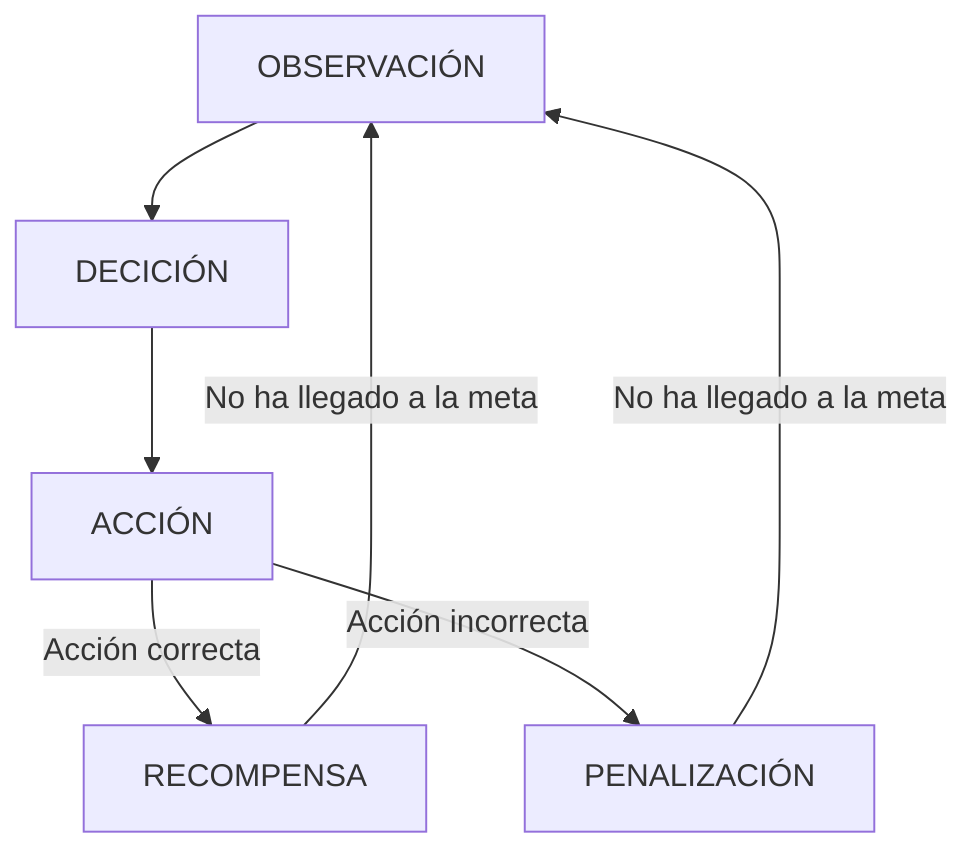

# IAV23-Chen
Trabajo final Inteligencia Artificial 2023.

El trabajo consiste en investigar y utilizar en un pequeño ejemplo la herramienta de Machine Learning MLAgent proporcionado por unity. Es una herramienta para el aprendizaje automático de unos agentes para que haga cierto tarea,movimiento , para que tenga una "inteligencia".

Esta herramienta tiene dos modos de aprendizaje :
- Una basada en el aprendizaje por refuerzo , la cual basada en una observación,hace una decisión de la cual convella a una acción y si la acción es la correcta , recibe una recompensa.



- Otra basada en el aprendizaje por imitación , es decir , habrá un humano que este jugando y la herramienta recopilará datos para intentar imitar las acciones del jugador.

Toda documentación relacionado con la herramienta se encuentra en este [enlace](https://github.com/Unity-Technologies/ml-agents)
## Propuesta
La propuesta en este trabajo se trata de una escena simple de unity de la cual existe una plataforma y dos objetos.Un player la cual será el agente a la que entrenaremos y un checkpoint que será la posición que tiene que llegar el player.Se trata en esta parte de entrenar al agente para que desde cualquier posición pueda llegar al checkpoint situado en una posición aleatoria. Esta escena principal es simple para aplicar los conceptos y las herramientas de MLAgent de forma sencilla.

La idea es con la misma escena o una escena simple muy parecida, se utilice los dos tipos de aprendizaje automático, si la escena fuera la misma , se puede hacer una comparación entre esos dos métodos.

Despues del entrenamiento del agente , se deberá notar en una primera ejecución que el agente tiene un comportamiento inteligente para llegar a la meta.
## Punto de Partida
Se empezará con un proyecto vacío de Unity en la cual importaremos el asset package de MLAgent de unity.La versión utilizada es la Release 17. Las configuraciones y documuentación de la release 17 se encuentra en este [enlace](https://github.com/Unity-Technologies/ml-agents/releases/tag/release_17)

Los materiales será simples creado por mí mismo o assets del asset store de unity gratuitos.
## Diseño de la solución
Antes de empezar con el entrenamiento del agente , es necesario hacer unas cuantas configuraciones e instalaciones.


-Instalación de Python, ver en la documentación la versión que se pide , en este caso 3.6.1  o mayor , se ha optado por utilizar el último release de versión 3.6.8 . 

-Creación del entorno virtual de python.

```
//Desde el directorio del proyecto de unity , venv= virtual environment
py -m venv venv
```
Este proceso se hace para separar las configuraciones de python del proyecto en un entorno aparte y asi no pisar las configuraciones del sistema.
Todas las configuraciones en este entorno no tendrá impacto en otros proyectos de python.

-Instalación de MlAgent en Python
```
//Dentro del venv para updatear el último paquete de pip
py -m pip install --upgrade pip

// Pytorch es una dependencia que tiene mlAgent por lo que es necesario instalarlo.
pip3 install torch~=1.7.1 -f https://download.pytorch.org/whl/torch_stable.html
// Para instalar mlagents
python -m pip install mlagents==0.26.0

```
[Guia de instalación](https://github.com/Unity-Technologies/ml-agents/blob/release_17_branch/docs/Installation.md)


En unity:

-Configurar el script de agente para anotar las obvervaciones , deciciones , acciones y recompensa.

-Entrenar el agente, con esto se genera un archivo que es el brain del agente.

-Con ese brain, se le puede asignar al agente para que se comporte de la forma como ha sido entrenado.


Problemas:

-Se ha encontrado problemas a la hora de instalar pytorch , utilizando la última versión de python 3.11.3 no se instala la versión 1.7.1.
-Se ha encontrado problemas a la hora de ejecutar mlagent-learn con python 3.7.9 por lo que se ha probado con distintas versiones y se ha elegido la 3.6.8 .