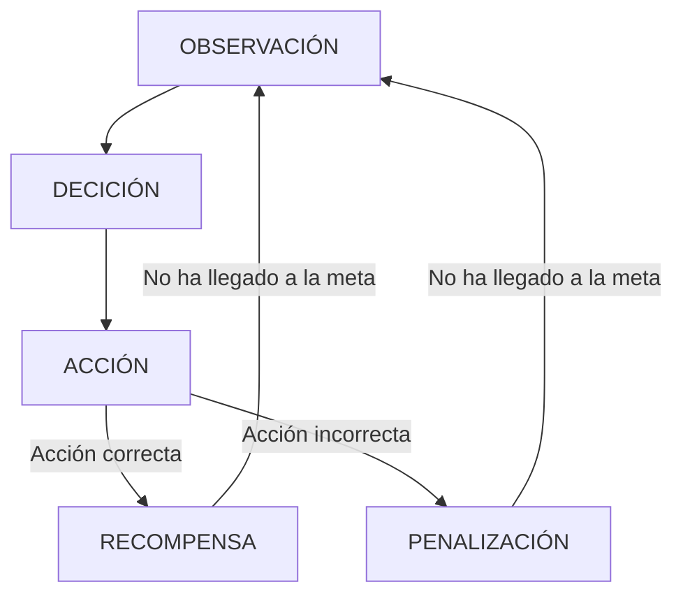

# IAV23-Chen
Trabajo final Inteligencia Artificial 2023.

El trabajo consiste en investigar y utilizar en un pequeño ejemplo la herramienta de Machine Learning MLAgent proporcionado por unity. Es una herramienta para el aprendizaje automático de unos agentes para que haga cierto tarea, movimiento , para que tenga una "inteligencia".

Esta herramienta tiene dos modos de aprendizaje :
- Una basada en el aprendizaje por refuerzo , la cual basada en una observación , hace una decisión de la cual convella a una acción y si la acción es la correcta , recibe una recompensa.


- Otra basada en el aprendizaje por imitación , es decir , habrá un humano que este jugando y la herramienta recopilará datos para intentar imitar las acciones del jugador. Se guardará en una demo el proceso del juego por parte de un usuario , se usará ese demo como ejemplo en el aprendizaje.

Toda documentación relacionado con la herramienta se encuentra en este [enlace](https://github.com/Unity-Technologies/ml-agents).
## Propuesta
La propuesta en este trabajo se trata de una escena simple de unity de la cual existe una plataforma y dos objetos.Un player la cual será el agente a la que entrenaremos y un checkpoint que será la posición que tiene que llegar el player.Se trata en esta parte de entrenar al agente para que desde cualquier posición pueda llegar al checkpoint situado en una posición aleatoria. Esta escena principal es simple para aplicar los conceptos y las herramientas de MLAgent de forma sencilla.

Una segunda escena en la cual consiste en que el player además de llegar a una meta , tiene por delante un muro que le impide , para desactivar ese muro y asi llegar a la meta , prevíamente tiene que pasar por un cubo la cual actuará de botón , una vez llegado al botón, desactiva el muro y podrá llegar a la meta.

Despues del entrenamiento del agente , se generará una archivo de red neuronal que se le asignará al agente , entonces se deberá notar en una primera ejecución que el agente tiene un comportamiento inteligente para llegar al objetivo deseado.
## Punto de Partida
Se empezará con un proyecto vacío de Unity en la cual importaremos el asset package de MLAgent de unity.La versión utilizada es la Release 17. Las configuraciones y documuentación de la release 17 se encuentra en este [enlace](https://github.com/Unity-Technologies/ml-agents/releases/tag/release_17).

Los assets serán los predefinidos por unity y los materiales simples que se diferencian entre sus colores.

## Diseño de la solución
Antes de empezar con el entrenamiento del agente , es necesario hacer unas cuantas configuraciones e instalaciones.


-Instalación de Python, ver en la documentación la versión que se pide , en este caso 3.6.1  o mayor , se ha optado por utilizar el último release de versión 3.6.8 . 

-Creación del entorno virtual de python.

```
//Desde el directorio del proyecto de unity , venv= virtual environment
py -m venv venv
```
Este proceso se hace para separar las configuraciones de python del proyecto en un entorno aparte y asi no pisar las configuraciones del sistema.
Todas las configuraciones en este entorno no tendrá impacto en otros proyectos de python.

-Instalación de MlAgent en Python
```
//Dentro del venv para updatear el último paquete de pip
py -m pip install --upgrade pip

// Pytorch es una dependencia que tiene mlAgent por lo que es necesario instalarlo.
pip3 install torch~=1.7.1 -f https://download.pytorch.org/whl/torch_stable.html
// Para instalar mlagents
python -m pip install mlagents==0.26.0

```
Existe para ello una guía de instalación proporcionado por MLAgents.

[Guia de instalación](https://github.com/Unity-Technologies/ml-agents/blob/release_17_branch/docs/Installation.md)


### Escena 1

Los pasos a seguir para llegar a los resultados son.

- Se crea un script que heredará de la clase agent de MLAgents , su función es todo lo relacionado con el aprendizaje como la anotación de observaciones , la toma de deciones , las acciones que debe hacer y la anotación de recompensas y fin del episiodio.

Acción:

    public override void OnActionReceived(ActionBuffers actions)
    {
        //La posición 0 del array lo interpretamos como la posición del agente en el punto x
        //La posición 1 del array lo interpretamos como la posición del agente en el punto z
        float x = actions.ContinuousActions[0];
        float z = actions.ContinuousActions[1];
        //Se le suma esa posición al agente
        transform.localPosition += new Vector3(x, 0, z) * Time.deltaTime * speed;

    }

Observación:

  
      public override void CollectObservations(VectorSensor sensor)
          {
      //Se añade como observa
      //V2
      Vector3 dirToPint = (checkpointr.transform.localPosition - transform.localPosition).normalized;
      sensor.AddObservation(dirToPint.x);
      sensor.AddObservation(dirToPint.z);
              //V1
              //sensor.AddObservation(transform.localPosition.x);
              //sensor.AddObservation(transform.localPosition.z);
              //sensor.AddObservation(checkpointr.localPosition.x);
              //sensor.AddObservation(checkpointr.localPosition.z);
          }

Notese que en la versión V1 , se recoje los puntos del jugador y del checkpoint de forma directa , la cual la posición del checkpoint no cambia durante el proceso de aprendizaje por lo tanto es una información no relevante para la máquina.

Para mejorar eso en una segunda versión se recoge solamente la distancia que hay entre el jugador y el checkpoint y los resultados obtenidos de son mejores a diferencia del V1.

Reseteo de parámetros al comenzar otra ronda de entrenamiento:

    public override void OnEpisodeBegin()
      {
          transform.localPosition = new Vector3(Random.Range(0, 6f), 0, Random.Range(-3f, 3f));
          checkpointr.localPosition = new Vector3(Random.Range(-6f, -2f), 0, Random.Range(-3f, 3f));
      }

Heurística , sirve para probar la escena con inputs humanos, además de que sirve tambien para la grabación de demo en el aprendizaje por imitación.

    public override void Heuristic(in ActionBuffers actionsOut)
    {
        ActionSegment<float> actions = actionsOut.ContinuousActions;
        actions[0] = Input.GetAxisRaw("Horizontal");
        actions[1] = Input.GetAxisRaw("Vertical");
    }

Recompensas y final de episodio:

    private void OnTriggerEnter(Collider other)
    {
        //Si es una pared , se penaliza y se reinicia
        if (other.CompareTag("Wall"))
        {
            floor.GetComponent<Renderer>().material = fail;
            AddReward(-1f);
            EndEpisode();
        }
        //Si es el punto final , se recompensa y se reinicia
        else if (other.CompareTag("Finish"))
        {
            floor.GetComponent<Renderer>().material = success;
            AddReward(1f);
            EndEpisode();
        }
    }

En este caso se recibe una recompensa si es capáz de llegar a la meta, y se recibe una penalización en caso de chocarse con la pared , ambos casos se termina el episodio y se empieza uno nuevo.


- Se le asigna este script al objeto agente en la escena y se le añade de forma automática otro script llamado Behavior Parameters.

<image src="/Images/Bh.png">

Behavior Name: Nombre del comportamiento

Vector Observation : El vector donde guardarse todas las observaciónes.

Space Size : El tamaño del vector , si por ejemplo se guarda la observación de un vector3 y un booleano, entonces su tamaño es 4 , siendo las xyz del vector y el boolenano.

Stacket Vector : Opción un poco más avanzada , para indicar el número de vectores antiguos a tener en cuenta , si está a uno , solo tendrá en cuenta el vector de observaciones actual.

Actions : Las acciones que puede hacer el agente , se diferencia en dos tipos , continuas o discretas.

Continuous Actions : El número del tamaño del vector de acciones contínuas , las acciones contínuas devuelve un número en float de -1 a 1 . En este caso se usa un tamaño de dos , uno para movimiento en el eje X y otro para el eje Z.

Discrete Branch : El tamaño del vector de acciones discretas. Una vez puesto un número mayor a 0 , aparecerá por debajo para definir el número de posibles valores para cada branch. Por ejemplo en este caso , en vez de utilizar las acciones contínuas , se puede usar las acciones discretas en tamaño dos (uno para ejeX otro para ejeZ) , donde el tamaño de cada branch es 3 (0=No mueve ,1=Mover Derecha 2=Mover Izquierda , parecido en el ejeZ).
Se utiliza en el escena2 para hacer variantes.

Model : Aqui se pone la red neuronal generada después del aprendizaje , obviamente en un principio sera None ya que no existe ninguno.

Inference Device : El dispositivo que se va a usar para los cálculos , en este caso se usa cpu porque se ha descargado el pytorch para cpu solo.

Behavior Type : El tipo del comportamiento , si es heuristic pues usará el código del script para moverse manualmente , sirve para hacer test del correcto funcionamiento de la escena , si es inference , usará la red neuronal generado después del aprendizaje , sirve para comprobar el correcto funcionamiento del aprendizaje y ya para que el agente se comporte de forma inteligente. La última opción default que deberá estar activado antes de empezar el aprendizaje.


<image src="/Images/MaxStep.png">

Si se hereda de la clase agents , nos mostrará una configuración de los pasos máximos que puede dar el agente antes de reiniciarse , un valor muy alto puede ocasionar que el agente se quede atascado en una esquina y no pueda avanzar , y un valor muy bajo puede ocasionar que los pasos dados no sean lo suficiente para llegar a la meta y te reinicia antes de conseguirlo por lo que ocasiona que nunca se de el correcto.


Para que empieze a tomar las decisiones , es necesario añadir al agente el script Decision Requester , no es necesario configurar nada aqui.
  
   

Si todo lo anterior se ha configurado bien , ahora deberíamos poder empezar con el aprendizaje.

Para que el aprendizaje vaya más rápido , podemos crear un prefab del entorno y multiplicarlo por mucho, asi tendremos a muchos agentes aprendiendo en paralelo.

Para agilizar el proceso de configuraciones de parámetros , se crea un archivo .yaml donde se indica todas las configuraciones necesarias para este aprendizaje. Ejemplo de archivo se encuentra en la carpeta config. Todos los parametros y sus significados se encuentra en este [enlace](https://github.com/Unity-Technologies/ml-agents/blob/release_17_branch/docs/Training-Configuration-File.md).

Una vez teniendo todo lo anterior se puede empezar a usar la herramienta.
```
mlagents-learn config\moveToPoint.yaml --run-id=MoveToPoint
```
//Imagen a cambiar
<image src="/Images/MaxStep.png">

Saldrá esto y ya dandole al play en unity empezará el proceso de aprendizaje.

### Resultados Escena1

Podemos ver el aprendizaje en la versión V1.

<image src="/Images/MP_V1.png">

Vemos que empieza a probar valores pero los resultados obtenidos no son muy buenos (se choca contra la pared) y por tanto la recompensa media es negativa. Pero a medida que va avanzando el tiempo se da cuenta de cómo tiene que llegar y sube poco a poco la recompensa media llegando así al final del entrenamiento una recompensa media de 0.991 , la más alta en este caso es un 1.

**Nota Importante** : Para usar la red neuronal V1 , es necesario cambiar Vector Observation a 4 como está implementado en el código. En el código comentar la parte de V2 y descomentar V1.

En el aprendizaje de la versión V2.

<image src="/Images/MP_V1.png">

Al igual que en el V1 , empieza con una recompensa media negativa , pero podemos notar que las recompensas suben de manera más rápida que en la versión V1 , esto es simplemente por haber cambiado la observación , obteniendo asi entonces un resultado mucho mejor en comparación con la primera.

### Escena 2

En esta escena el agente tiene que accionar un botón para eliminar el muro y llegar a la meta.

El proceso de configuración es igual a la primera teniendo en cuenta pequeños detalles.

Acciones: 

public override void OnActionReceived(ActionBuffers actions)
    {
        //La posición 0 del array lo interpretamos como la posición del agente en el punto x
        //La posición 1 del array lo interpretamos como la posición del agente en el punto z

        int x = actions.DiscreteActions[0]; //0:No se mueve 1:Derecha 2:Izquierda
        int z = actions.DiscreteActions[1]; //0:No se mueve 1:Delante 2:Detras

        Vector3 force = new Vector3(0,0,0);
        switch (x)
        {
            case 0: force.x = 0f;
                break;
            case 1:
                force.x = 1f;
                break;
            case 2:
                force.x = -1f;
                break;
        }
        switch (z)
        {
            case 0:
                force.z = 0f;
                break;
            case 1:
                force.z = 1f;
                break;
            case 2:
                force.z = -1f;
                break;
        }
        //transform.localPosition += new Vector3(x, 0, z) * Time.deltaTime * speed;
        GetComponent<Rigidbody>().velocity = force * speed + new Vector3(0, GetComponent<Rigidbody>().velocity.y, 0);

        //AddReward(-1f / MaxStep);
    }
En este caso se ha usado la acción discreta que dependiendo del número que salga se le sumará una fuerza u otra.

Observación : 

    public override void CollectObservations(VectorSensor sensor)
        {
            //Se añade como observa
            Vector3 dirToButton = (button.transform.localPosition - transform.localPosition).normalized;
            sensor.AddObservation(dirToButton.x);
            sensor.AddObservation(dirToButton.z);
            bool doorOpen = button.GetComponent<DoorButton>().isOpen();
            sensor.AddObservation(doorOpen);
            if (doorOpen)
            {
                Vector3 dirToCheckpoing = (checkPoint.transform.localPosition - transform.localPosition).normalized;
                sensor.AddObservation(dirToCheckpoing.x);
                sensor.AddObservation(dirToCheckpoing.z);
            }
            else
            {
                sensor.AddObservation(0f);
                sensor.AddObservation(0f);
            }
        }

En este caso se añade como observación el estado el muro , no se le da la dirección del checkpoint hasta que el muro no sea desactivado.

Los demás métodos son muy parecidos cambiando por ejemplo , se da recompensa cuando acciona el botón. Se puede mirar detalladamente en el script.

Lo que sí es que en esta escena se va a hacer una comparación entre el aprendizaje por refuerzo y el de por imitación.

Para ello es necesario grabar una demo en la cual estemos resolviendo el problema.

- Además de todos los componentes mencionados en la escena uno , se añade un nuevo componente llamada Demostration Recorder , solo es necesario añadirlo a uno , sin añadirlo al prefab.

- Se espicifica el directorio de salida y el nombre del archivo que se va a generar.

- Darle al tick a record

- Cambiar el Behavior Type a heuristic para que podamos controlar manualmente al agente.

- Darle al play y jugar/ realizar las acciones necesarias.

Después de todo eso , obtendremos un archivo .demo.

Con eso , configuramos el archivo yaml para que tenga en cuenta la demo. 

      gail:
          strength: 0.2
          demo_path: Demos/OpenDoorDemo.demo
      behavioral_cloning:
          strength: 0.3
          demo_path: Demos/OpenDoorDemo.demo

Gail : usa un discriminador para elegir las acciones a realizar.

Behavioral_cloning : Hace las acciones identicas de las que aparecen en la demo.

Strength: La cantidad que afecta en el aprendizaje.

Con todo lo de arriba configurado , ahora podemos hacer la prueba de diferencia entre el aprendizaje por refuerzo y por imitación en esta escena.

### Resultado Escena2 

En esta escena se obtiene un punto por accionar un botón y otro punto por llegar a la meta , por lo tanto la puntuación máxima es de 2.

En la versión de aprendizaje por refuerzo , podemos ver que aprende a pulsar el botón por lo que obtiene un punto , pero a partir de alli ya no sabe que hacer , por lo que se queda quieto hasta que llegue el max step, en ningún momento se ha logrado completar el task entero.

<image src="/Images/OD_Normal.png">

En la versión de aprendizaje por imitación podemos ver que desde un principio ya algunos agentes consigue el task completo por lo que el mean reward es superior a uno.Pero a medida que va avanzando en el tiempo , tiene más en cuenta las variables aleatorias que los datos del demo , por lo tanto va bajando el mean reward. No he encontrado ninguna información que explique este fenómeno ,pero puedo suponer que es una incompatibilidad del demo con las observaciones y acciones que toma la herramienta.

<image src="/Images/OD_Imitation.png">

Por curiosidad y por tener una red neuronal buena para resolver este task , he probado que la herramienta haga el aprendizaje por refuerzo , partiendo de los resultados obtenidos en el aprendizaje por imitación.
```
mlagents-learn config\OpenDoor.yaml --initialize-from="ID del Imitación" --run-id=Learn_after_imitiation
```

Los resultados obtenidos parece ser muy buenos en la cual ya desde un principio se consigue pulsar el botón y algunos consiguen completar el task , despúes de pocos pasos más , ya el número de agentes que consiguen completar el task es mayor , llegando asi a la puntuación máxima en la mitad del proceso de aprendizaje

<image src="/Images/OD_AfterImitation.png">

La conclusión a la que he llegado es que , para las tareas complicadas , el aprendizaje por refuerzo puede tardar mucho o incluso fallar.
El aprendizaje por imitación es muy útil para un inicio , pero posteriormente se ve afectado por las variables aleatorias.

Una forma realmente efectiva es la combinación de ambas para el aprendizaje.

## Problemas:

-Se ha encontrado problemas a la hora de instalar pytorch , utilizando la última versión de python 3.11.3 no se instala la versión 1.7.1.

-Se ha encontrado problemas a la hora de ejecutar mlagent-learn con python 3.7.9 por lo que se ha probado con distintas versiones y se ha elegido la 3.6.8 .


## Pruebas y métricas

| Prueba | Descripción |
|----------|----------|
| A    | Resultado de la escena1 versión V1   | 
| B    | Resultado de la escena1 versión V2  | 
| C   | Resultado de la escena2 aprendizaje por refuerzo   |
| D    | Resultado de la escena2 aprendizaje por imitación   | 
| E   | Resultado de la escena2 aprendizaje por refuerzo a partir de unos resultados generado por aprendizaje por imitación   | 

[Video de las pruebas ](https://www.youtube.com/watch?v=MQAyFVS4SFQ)

## Conclusiones

MLAgents es una herramienta muy buena para hacer IA inteligentes, la dificultad de la herramienta depende de el objetivo final que se quiera conseguir. Es difícil de empezar y la diferencia de los resultados puede llegar a ser enorme dependiendo del conocimiento de cada uno sobre la herramienta , pero si se investiga y se hace pruebas y dedicas tiempo , al final puede salir un resultado muy interesante.

## Referencias

- [Documentos de MLAgents release 17](https://github.com/Unity-Technologies/ml-agents/tree/release_17_branch/docs)

- [How to use Machine Learning AI in Unity! - CODEMONKEY](https://www.youtube.com/watch?v=zPFU30tbyKs)

- [Teach your AI! Imitation Learning with Unity ML-Agents! - CODEMONKEY](https://www.youtube.com/watch?v=supqT7kqpEI)

- [Unity MLAgents ToolKit](https://github.com/Unity-Technologies/ml-agents)

