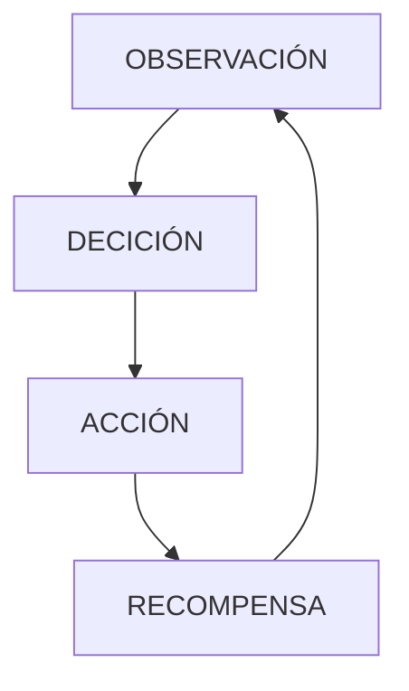

# IAV23-Chen
Trabajo final Inteligencia Artificial 2023.

El trabajo consiste en investigar y utilizar en un pequeño ejemplo la herramienta de Machine Learning MLAgent proporcionado por unity. Es una herramienta para el aprendizaje automático de unos agentes para que haga cierto tarea,movimiento , para que tenga una "inteligencia".

Esta herramienta está basada en el aprendizaje por refuerzo , la cual basada en una observación,hace una decisión de la cual convella a una acción y si la acción es la correcta , recibe una recompensa.

