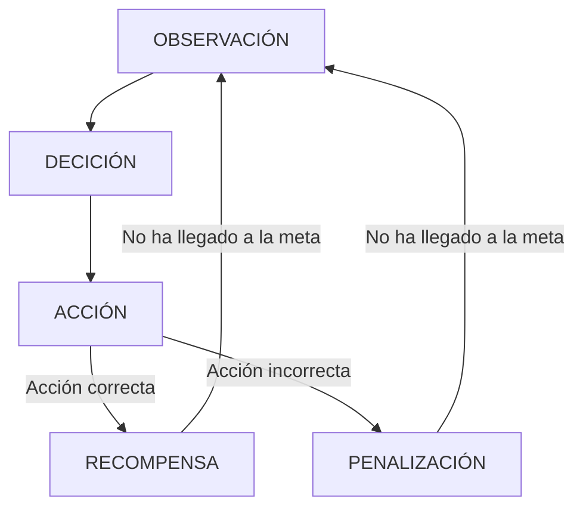

# IAV23-Chen
Trabajo final Inteligencia Artificial 2023.

El trabajo consiste en investigar y utilizar en un pequeño ejemplo la herramienta de Machine Learning MLAgent proporcionado por unity. Es una herramienta para el aprendizaje automático de unos agentes para que haga cierto tarea,movimiento , para que tenga una "inteligencia".

Esta herramienta está basada en el aprendizaje por refuerzo , la cual basada en una observación,hace una decisión de la cual convella a una acción y si la acción es la correcta , recibe una recompensa.

Toda documentación relacionado con la herramienta se encuentra en este [enlace](https://github.com/Unity-Technologies/ml-agents)
## Propuesta
La propuesta en este trabajo se trata de una escena simple de unity de la cual existe una plataforma y dos objetos.Un player la cual será el agente a la que entrenaremos y un checkpoint que será la posición que tiene que llegar el player.Se trata en esta parte de entrenar al agente para que desde cualquier posición pueda llegar al checkpoint situado en una posición aleatoria. Esta escena principal es simple para aplicar los conceptos y las herramientas de MLAgent de forma sencilla por la cual muy posiblemente se haga otra escena de ampliación en la que las cosas son un poco más complicadas.

Despues del entrenamiento del agente , se deberá notar en una primera ejecución que el agente tiene un comportamiento inteligente para llegar a la meta.
## Punto de Partida
Se empezará con un proyecto vacío de Unity en la cual importaremos el asset package de MLAgent de unity.La versión utilizada es la Release 17. Las configuraciones y documuentación de la release 17 se encuentra en este [enlace](https://github.com/Unity-Technologies/ml-agents/releases/tag/release_17)

Los materiales será simples creado por mí mismo o assets del asset store de unity gratuitos.
## Diseño de la solución
Antes de empezar con el entrenamiento del agente , es necesario hacer unas cuantas configuraciones e instalaciones.

-Instalación de Python

-Instalación de entorno virtual Python

-Instalación de MlAgent en Python

En unity:

-Configurar el script de agente para anotar las obvervaciones , deciciones , acciones y recompensa.

-Entrenar el agente, con esto se genera un archivo que es el brain del agente.

-Con ese brain, se le puede asignar al agente para que se comporte de la forma como ha sido entrenado.