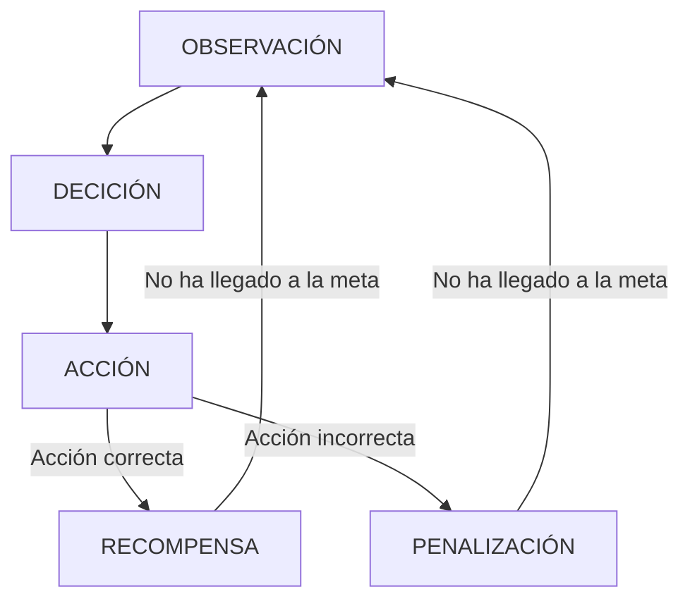

# IAV23-Chen
Trabajo final Inteligencia Artificial 2023.

El trabajo consiste en investigar y utilizar en un pequeño ejemplo la herramienta de Machine Learning MLAgent proporcionado por unity. Es una herramienta para el aprendizaje automático de unos agentes para que haga cierto tarea, movimiento , para que tenga una "inteligencia".

Esta herramienta tiene dos modos de aprendizaje :
- Una basada en el aprendizaje por refuerzo , la cual basada en una observación , hace una decisión de la cual convella a una acción y si la acción es la correcta , recibe una recompensa.


- Otra basada en el aprendizaje por imitación , es decir , habrá un humano que este jugando y la herramienta recopilará datos para intentar imitar las acciones del jugador. Se guardará en una demo el proceso del juego por parte de un usuario , se usará ese demo como ejemplo en el aprendizaje.

Toda documentación relacionado con la herramienta se encuentra en este [enlace](https://github.com/Unity-Technologies/ml-agents).
## Propuesta
La propuesta en este trabajo se trata de una escena simple de unity de la cual existe una plataforma y dos objetos.Un player la cual será el agente a la que entrenaremos y un checkpoint que será la posición que tiene que llegar el player.Se trata en esta parte de entrenar al agente para que desde cualquier posición pueda llegar al checkpoint situado en una posición aleatoria. Esta escena principal es simple para aplicar los conceptos y las herramientas de MLAgent de forma sencilla.

Una segunda escena en la cual consiste en que el player además de llegar a una meta , tiene por delante un muro que le impide , para desactivar ese muro y asi llegar a la meta , prevíamente tiene que pasar por un cubo la cual actuará de botón , una vez llegado al botón, desactiva el muro y podrá llegar a la meta.

Despues del entrenamiento del agente , se generará una archivo de red neuronal que se le asignará al agente , entonces se deberá notar en una primera ejecución que el agente tiene un comportamiento inteligente para llegar al objetivo deseado.
## Punto de Partida
Se empezará con un proyecto vacío de Unity en la cual importaremos el asset package de MLAgent de unity.La versión utilizada es la Release 17. Las configuraciones y documuentación de la release 17 se encuentra en este [enlace](https://github.com/Unity-Technologies/ml-agents/releases/tag/release_17).

Los assets serán los predefinidos por unity y los materiales simples que se diferencian entre sus colores.

## Diseño de la solución
Antes de empezar con el entrenamiento del agente , es necesario hacer unas cuantas configuraciones e instalaciones.


-Instalación de Python, ver en la documentación la versión que se pide , en este caso 3.6.1  o mayor , se ha optado por utilizar el último release de versión 3.6.8 . 

-Creación del entorno virtual de python.

```
//Desde el directorio del proyecto de unity , venv= virtual environment
py -m venv venv
```
Este proceso se hace para separar las configuraciones de python del proyecto en un entorno aparte y asi no pisar las configuraciones del sistema.
Todas las configuraciones en este entorno no tendrá impacto en otros proyectos de python.

-Instalación de MlAgent en Python
```
//Dentro del venv para updatear el último paquete de pip
py -m pip install --upgrade pip

// Pytorch es una dependencia que tiene mlAgent por lo que es necesario instalarlo.
pip3 install torch~=1.7.1 -f https://download.pytorch.org/whl/torch_stable.html
// Para instalar mlagents
python -m pip install mlagents==0.26.0

```
Existe para ello una guía de instalación proporcionado por MLAgents.

[Guia de instalación](https://github.com/Unity-Technologies/ml-agents/blob/release_17_branch/docs/Installation.md)


### Escena 1

Los pasos a seguir para llegar a los resultados son.

- Se crea un script que heredará de la clase agent de MLAgents , su función es todo lo relacionado con el aprendizaje como la anotación de observaciones , la toma de deciones , las acciones que debe hacer y la anotación de recompensas y fin del episiodio.

Acción:

    public override void OnActionReceived(ActionBuffers actions)
    {
        //La posición 0 del array lo interpretamos como la posición del agente en el punto x
        //La posición 1 del array lo interpretamos como la posición del agente en el punto z
        float x = actions.ContinuousActions[0];
        float z = actions.ContinuousActions[1];
        //Se le suma esa posición al agente
        transform.localPosition += new Vector3(x, 0, z) * Time.deltaTime * speed;

    }

Observación:

  
      public override void CollectObservations(VectorSensor sensor)
          {
      //Se añade como observa
      //V2
      Vector3 dirToPint = (checkpointr.transform.localPosition - transform.localPosition).normalized;
      sensor.AddObservation(dirToPint.x);
      sensor.AddObservation(dirToPint.z);
              //V1
              //sensor.AddObservation(transform.localPosition.x);
              //sensor.AddObservation(transform.localPosition.z);
              //sensor.AddObservation(checkpointr.localPosition.x);
              //sensor.AddObservation(checkpointr.localPosition.z);
          }

Notese que en la versión V1 , se recoje los puntos del jugador y del checkpoint de forma directa , la cual la posición del checkpoint no cambia durante el proceso de aprendizaje por lo tanto es una información no relevante para la máquina.

Para mejorar eso en una segunda versión se recoge solamente la distancia que hay entre el jugador y el checkpoint y los resultados obtenidos de son mejores a diferencia del V1.

Reseteo de parámetros al comenzar otra ronda de entrenamiento:

    public override void OnEpisodeBegin()
      {
          transform.localPosition = new Vector3(Random.Range(0, 6f), 0, Random.Range(-3f, 3f));
          checkpointr.localPosition = new Vector3(Random.Range(-6f, -2f), 0, Random.Range(-3f, 3f));
      }

Heurística , sirve para probar la escena con inputs humanos, además de que sirve tambien para la grabación de demo en el aprendizaje por imitación.

    public override void Heuristic(in ActionBuffers actionsOut)
    {
        ActionSegment<float> actions = actionsOut.ContinuousActions;
        actions[0] = Input.GetAxisRaw("Horizontal");
        actions[1] = Input.GetAxisRaw("Vertical");
    }

Recompensas y final de episodio:

    private void OnTriggerEnter(Collider other)
    {
        //Si es una pared , se penaliza y se reinicia
        if (other.CompareTag("Wall"))
        {
            floor.GetComponent<Renderer>().material = fail;
            AddReward(-1f);
            EndEpisode();
        }
        //Si es el punto final , se recompensa y se reinicia
        else if (other.CompareTag("Finish"))
        {
            floor.GetComponent<Renderer>().material = success;
            AddReward(1f);
            EndEpisode();
        }
    }

En este caso se recibe una recompensa si es capáz de llegar a la meta, y se recibe una penalización en caso de chocarse con la pared , ambos casos se termina el episodio y se empieza uno nuevo.


- Se le asigna este script al objeto agente en la escena y se le añade de forma automática otro script llamado Behavior Parameters

<image src="/Images/Bh.png">

<image src="/Images/MaxStep.png">


-Configurar el script de agente para anotar las obvervaciones , deciciones , acciones y recompensa.

-Entrenar el agente, con esto se genera un archivo que es el brain del agente.

-Con ese brain, se le puede asignar al agente para que se comporte de la forma como ha sido entrenado.


## Problemas:

-Se ha encontrado problemas a la hora de instalar pytorch , utilizando la última versión de python 3.11.3 no se instala la versión 1.7.1.

-Se ha encontrado problemas a la hora de ejecutar mlagent-learn con python 3.7.9 por lo que se ha probado con distintas versiones y se ha elegido la 3.6.8 .


## Pruebas y métricas

| Prueba | Descripción |
|----------|----------|
| A    | El avatar se mueve por el mundo virtual con el raton izquierdo   | 
| B    | Publico huye cuando cae su respectivo foco y vuelve cuando se levanta  | 
| C1    |La cantante canta y descansa cíclicamente  |
| C2    | La cantante puede ser llevada por el fantasma y el vizconde, y a este último le sigue  | 
| C3   | La cantante deambula en zona desconocida  | 
| D   | Comportamiento en detalle del fantasma   |
| E    | Detección de eventos del fantasma  | 


## Referencias

- [Documentos de MLAgents release 17](https://github.com/Unity-Technologies/ml-agents/tree/release_17_branch/docs)
